# 小小商城

**项目介绍**

`IDEA` `SpringBoot` `Mybatis` `MySQL` `Redis`  `Vue` `ElementUI` `Axios` `Spring Security`  `JWT` 

&nbsp;&nbsp;&nbsp;&nbsp;小小商城是一个仿照天猫商城的基于`Spring Boot`开发的商城项目，登录注册实现了`md5`加密，登录后，用户可以浏览热门商品，通过商品分类和商品价格找到符合自己要求的商品，进行加入购物车或购买等；
&nbsp;&nbsp;&nbsp;&nbsp;后台管理的账户可以在管理系统上可以修改商品信息，商品分类信息，配置轮播图，热卖信息，进行订单的确认，备货，取消订单，对用户账户进行禁用，查看用户账号的状态，注销用户等。

## 功能概述

- 统角色划分图:

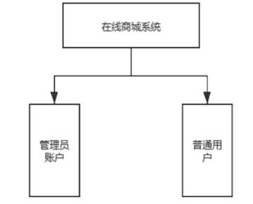

- 管理员框架图

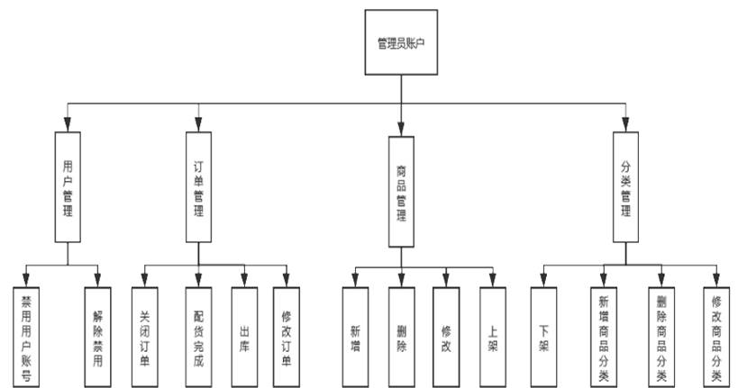

- 普通用户框架图

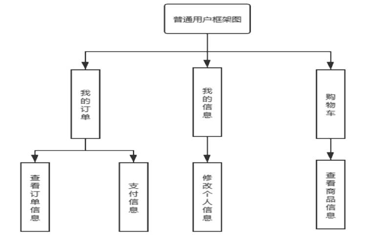

## 项目用户角色用例图

&nbsp;&nbsp;商城系统主要分为管理者账户、购买者账户。其中管理者账户可以实现增加商品信息、轮播图配置、热销商品配置、分类管理、商品管理、会员管理、订单管理功能。非管理员账户可以实现关键字查找和根据类别查找商品信息、创建订单、查看自己的订单信息和支付信息、阅读个人信息和修改。

- 普通用户用例图

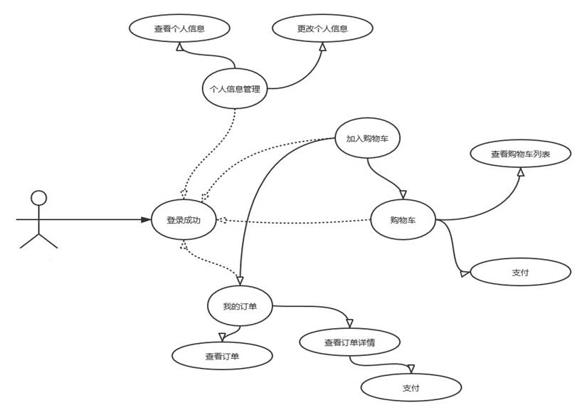

- 管理员用例图

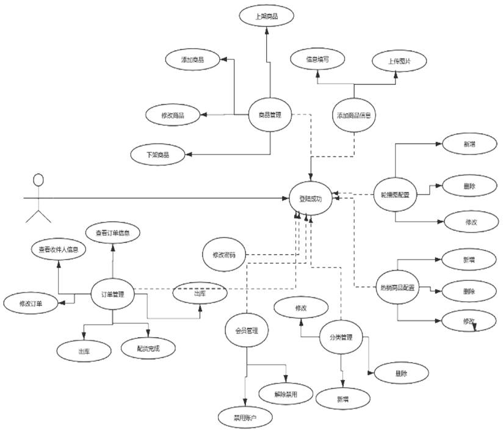

- 数据库设计 E-R图

  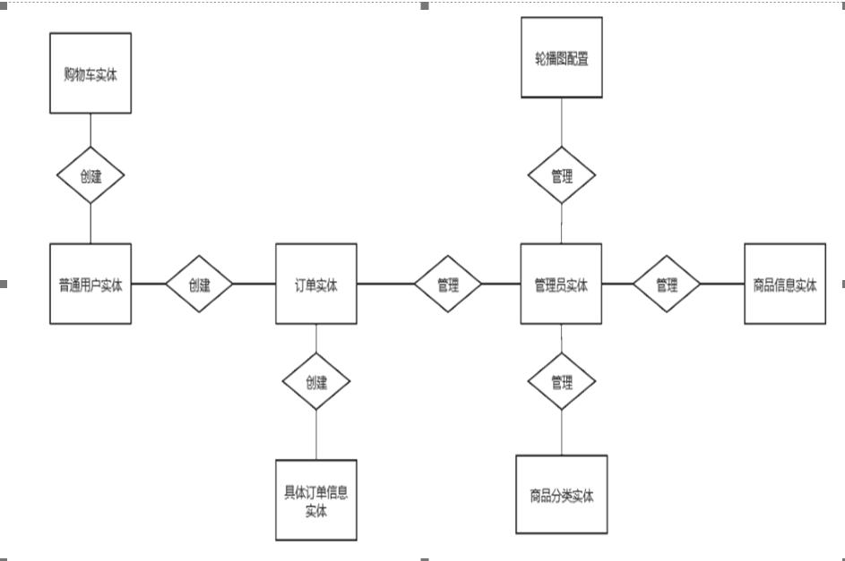

  (1)普通用户实体：(用户id、登录帐号、昵称、密码、个性签名、收货地址、是否被禁用标识、创建时间)；

  (2)管理员账户实体：(管理员用户id、登录账号、密码、昵称)；

  (3)商品信息实体：(商品id、商品名称、商品简要介绍、商品图片、商品详细介绍、商品价格、商品售卖价格、库存量、商品的小标签)；

  (4)商品分类实体：(商品类别的id、类别的节点代号、上一级级别类别id、分类的排序值、分类创建时间、创建人、更新时间、更新人)；

  (5)首页上商品配置实体：(配置主键id、配置商品名称、配置类型、所配置商品的id、商品图片、排序、创建时间、创建人、更新时间、更新人)；

  (6)订单实体：(订单id、订单号码、用户id、订单总价格、是否支付状态、支付方式、支付时间、订单状态、用户姓名、用户电话、用户住址、创建时间、更新时间)；

  (7)订单商品信息实体(主键id、订单id、商品id、商品名称、商品背景图片、商品售卖价格、订单包含的商品总数、创建时间)；

  (8)购物车实体(购物车主键id、用户id、商品id、商品总数、创建时间、更新时间)；

  (9)轮播图实体(主键id、商品图片、排序、创建时间、创建人、更新时间、更新人)。

## 项目功能介绍

- 用户登录,注册,首页,查看购物车,订单

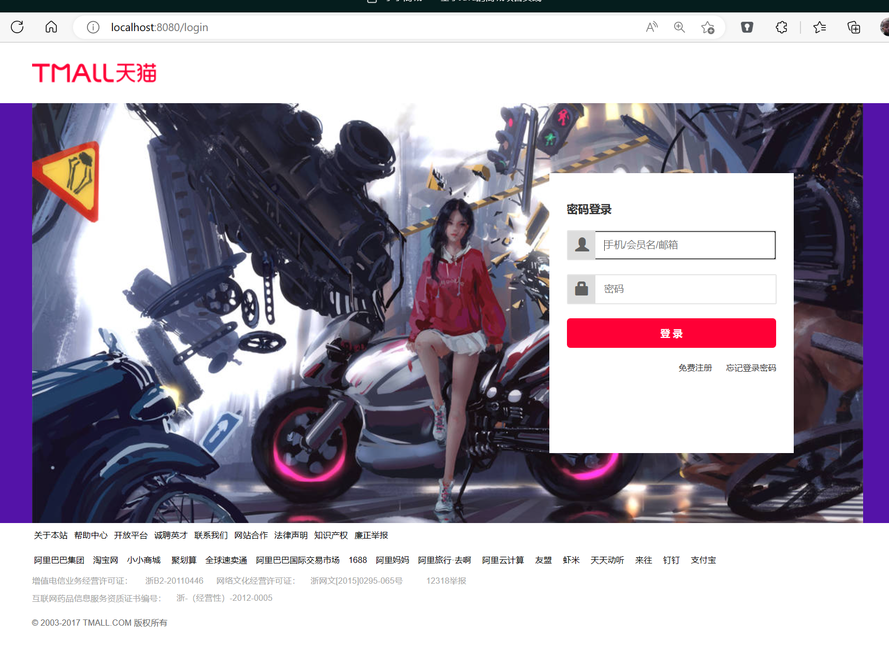

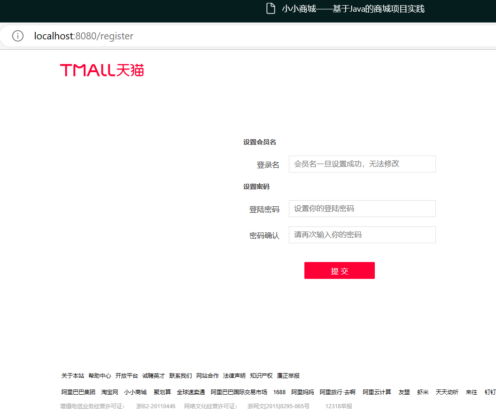

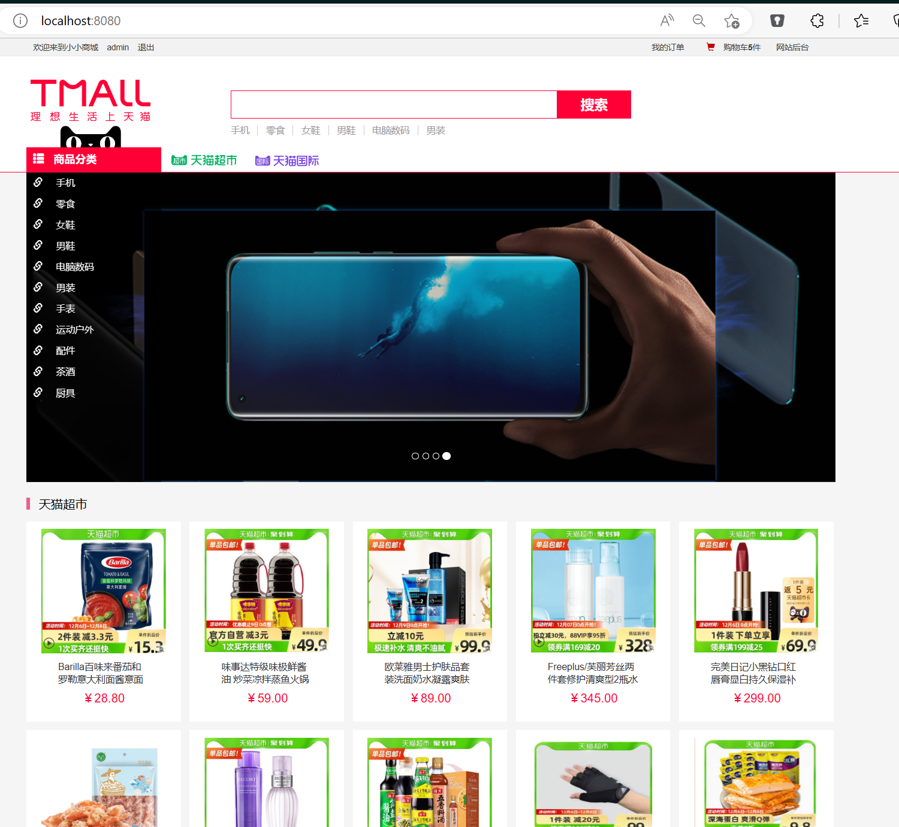

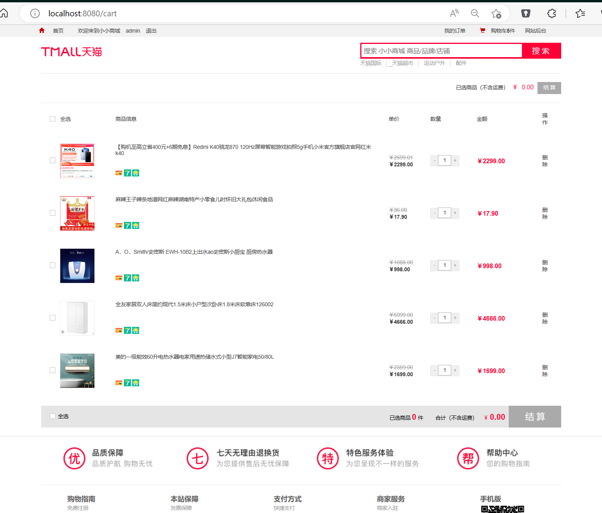

- 分类搜索,商品排序

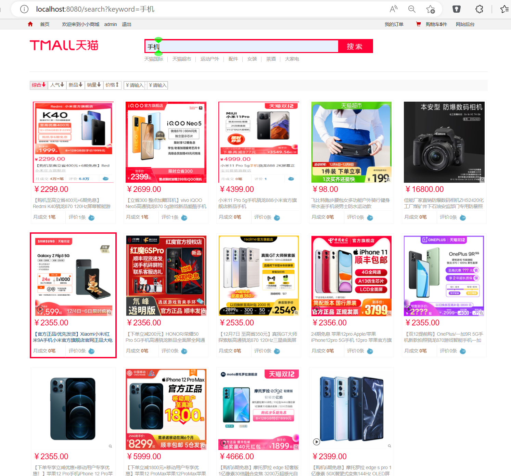

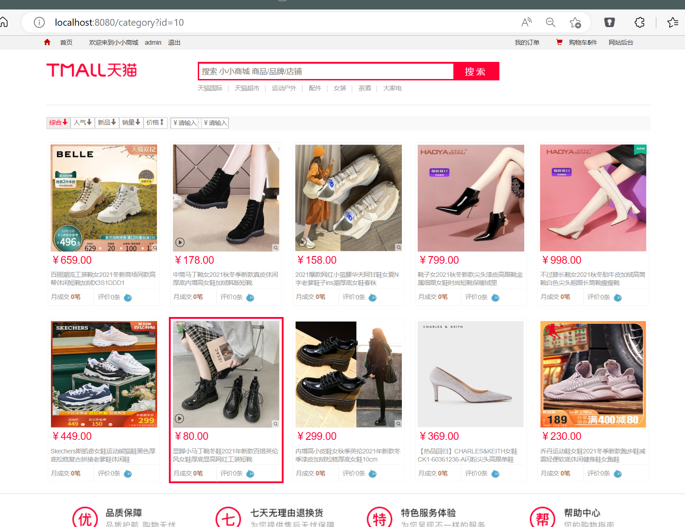

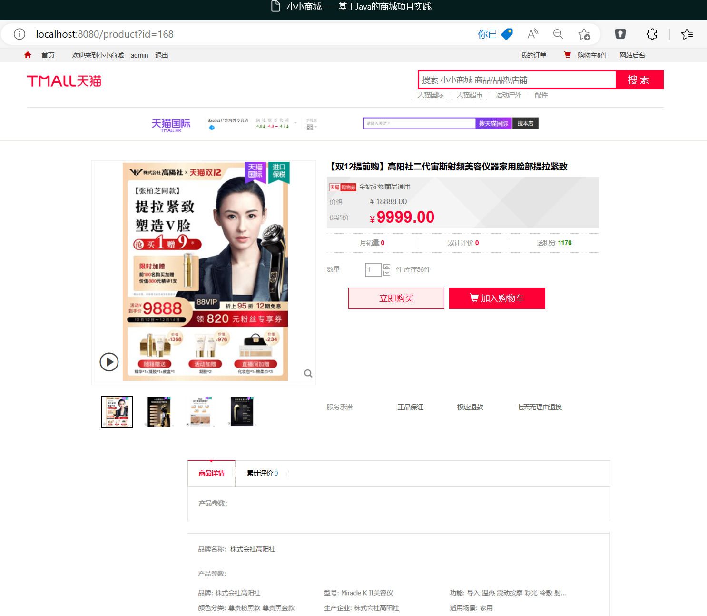

- 购买,提交订单,确认支付

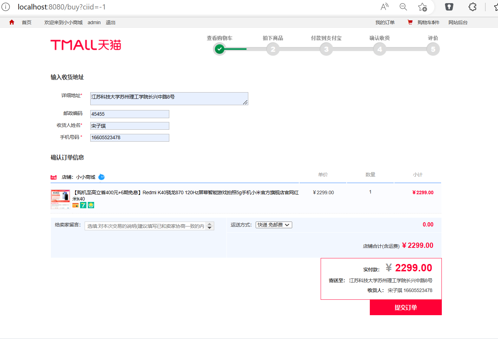

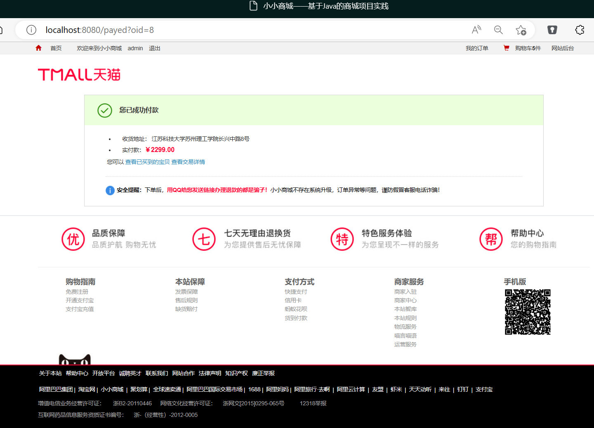