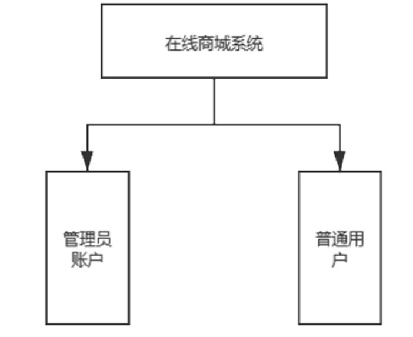

# 小小商城

**项目介绍**：
&nbsp;&nbsp;&nbsp;&nbsp;小小商城是一个仿照天猫商城的基于`Spring Boot`开发的商城项目，登录注册实现了`md5`加密，登录后，用户可以浏览热门商品，通过商品分类和商品价格找到符合自己要求的商品，进行加入购物车或购买等；
&nbsp;&nbsp;&nbsp;&nbsp;后台管理的账户可以在管理系统上可以修改商品信息，商品分类信息，配置轮播图，热卖信息，进行订单的确认，备货，取消订单，对用户账户进行禁用，查看用户账号的状态，注销用户等。

**功能概述**

- 统角色划分图:

- 管理员框架图

- 普通用户框架图

**项目用户角色用例图**

- 普通用户用例图

- 管理员用例图

